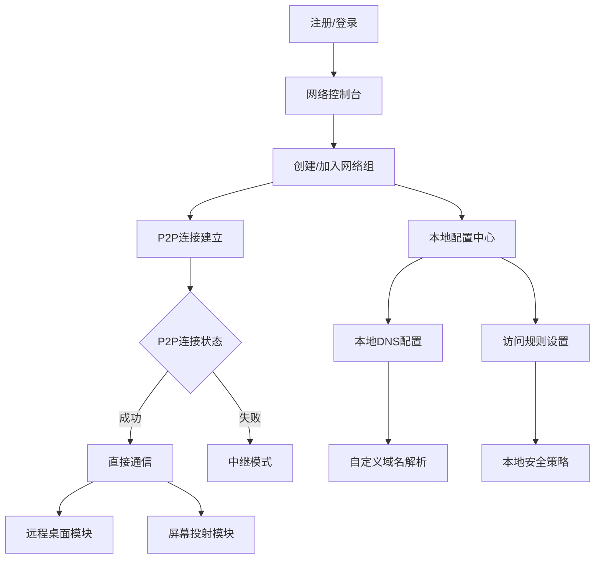

## 1. 产品概述

模块化P2P异地组网软件，核心为虚拟网络（VPN/SD-WAN）模块，上层可扩展远程控制、屏幕投射等功能模块。采用本地优先配置策略，服务器仅存储最小化组信息，所有配置在本地端管理。

解决传统远程控制软件依赖中心化服务器、延迟高、成本高的问题，为技术团队、远程办公、游戏联机等场景提供低延迟、低成本的P2P连接解决方案。支持严格P2P优先连接，失败时自动fallback到中继服务器。

## 2. 核心功能

### 2.1 用户角色

| 角色   | 注册方式 | 核心权限                  |
| ---- | ---- | --------------------- |
| 普通用户 | 邮箱注册 | 创建/加入网络组，P2P连接，自定义域名  |
| 高级用户 | 付费升级 | 更多并发连接，优先网络质量，高级DNS功能 |

### 2.2 功能模块

采用模块化架构设计，核心模块为异地组网，上层功能模块可独立开发部署：

**核心模块 - 异地组网**: 基础网络连接，P2P穿透，本地DNS解析

1. **网络控制台**: 网络组管理，设备发现，P2P连接状态
2. **本地配置中心**: 域名配置，访问规则，安全策略（本地存储）

**扩展模块 - 远程控制**: 基于核心组网模块的远程桌面功能

1. **远程桌面**: 桌面控制，键盘鼠标同步，剪贴板共享

**扩展模块 - 屏幕投射**: 基于核心组网模块的屏幕共享功能

1. **屏幕共享**: 实时屏幕传输，多屏支持，画质调节

### 2.3 页面详情

| 页面名称   | 模块名称    | 功能描述                           |
| ------ | ------- | ------------------------------ |
| 网络控制台  | 网络组管理   | 创建网络组，生成邀请码，查看组成员（仅显示基础信息）     |
| 网络控制台  | P2P连接管理 | 发起P2P连接请求，显示连接状态，自动fallback到中继 |
| 网络控制台  | 本地DNS拦截 | 拦截自定义域名请求，本地解析，无需修改系统hosts     |
| 本地配置中心 | 域名管理    | 添加/删除自定义域名，绑定虚拟IP，设置访问权限       |
| 本地配置中心 | 访问控制    | 配置端口开放规则，IP白名单，连接加密设置          |
| 本地配置中心 | 安全策略    | 本地存储访问令牌，设备证书，连接日志             |
| 远程桌面   | 桌面控制    | 基于已建立的P2P连接，实时桌面传输，输入同步        |
| 远程桌面   | 会话管理    | 多会话支持，画质调节，带宽自适应               |
| 屏幕共享   | 屏幕捕获    | 实时屏幕编码，帧率调节，区域选择               |
| 屏幕共享   | 观众管理    | 查看共享列表，请求观看权限，多观众支持            |

## 3. 核心流程

### 核心组网流程（所有用户）：

1. 用户A创建网络组，本地生成密钥对和组配置
2. 用户B使用邀请码加入，通过服务器验证后获得组内成员列表
3. 两端尝试P2P直连，失败时自动切换中继模式
4. 连接建立后，所有通信数据直接传输，不经过服务器

### 本地DNS配置流程：

1. 用户在本地添加自定义域名（如：git-server.local）
2. 绑定到对应设备的虚拟IP地址
3. 本地DNS拦截器捕获域名请求并解析
4. 组内其他成员无需配置即可访问

### 扩展功能使用流程：

1. 远程控制：基于已建立的P2P连接，发起远程桌面会话
2. 屏幕投射：选择共享屏幕，其他成员通过虚拟网络观看

## 4. 用户界面设计

### 4.1 设计风格

* **主色调**: 深蓝色(#1E3A8A)配绿色(#10B981)点缀

* **按钮风格**: 圆角矩形，悬停动画效果

* **字体**: 中文使用思源黑体，英文使用Inter，主要字号14-16px

* **布局风格**: 左侧导航栏+右侧内容区，卡片式信息展示

* **图标风格**: 使用简洁的线性图标，统一线条粗细

### 4.2 页面设计概览

| 页面名称    | 模块名称   | UI元素                      |
| ------- | ------ | ------------------------- |
| 主控制台    | 导航栏    | 左侧深色侧边栏，包含logo、导航菜单、用户头像  |
| 主控制台    | 网络组卡片  | 显示组名称、成员数量、在线状态，支持快速操作按钮  |
| P2P连接页面 | 设备列表   | 网格布局显示设备卡片，包含设备图标、名称、连接状态 |
| P2P连接页面 | 远程控制窗口 | 浮动窗口设计，包含工具栏、画质调节、全屏按钮    |
| DNS管理页面 | 域名列表   | 表格形式展示，支持搜索、排序、批量操作       |
| DNS管理页面 | 域名编辑弹窗 | 模态框设计，包含表单验证、实时预览         |

### 4.3 响应式设计

* 桌面端优先设计，支持Windows、macOS、Linux

* 通过Tauri实现跨平台，界面自适应不同屏幕尺寸

* 支持触摸操作优化，适配Surface等触屏设备

### 4.4 3D场景指导（如适用）

不适用 - 本产品主要为2D桌面应用界面

## 5. 技术特色

* **模块化架构**: 核心组网模块独立，上层功能可插拔扩展

* **本地优先配置**: 域名、访问规则等全部本地管理，保护隐私

* **严格P2P优先**: 优先直连，失败才使用中继，确保最低延迟

* **本地DNS拦截**: 无需系统权限即可实现自定义域名解析

* **服务器最小化**: 仅存储组关系，不保存用户配置和通信内容

