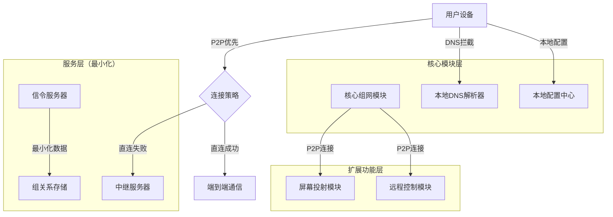
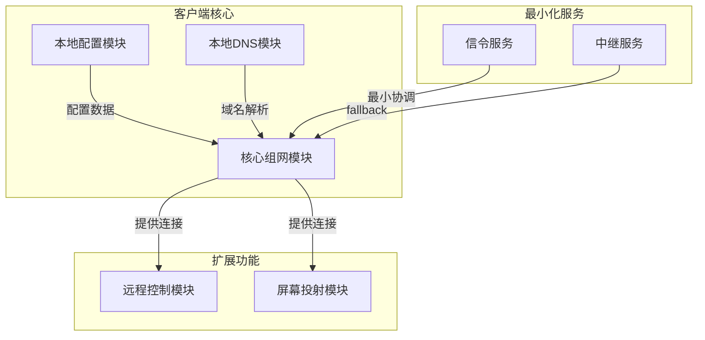
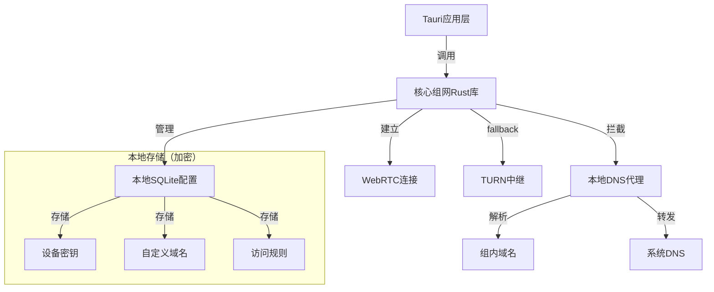
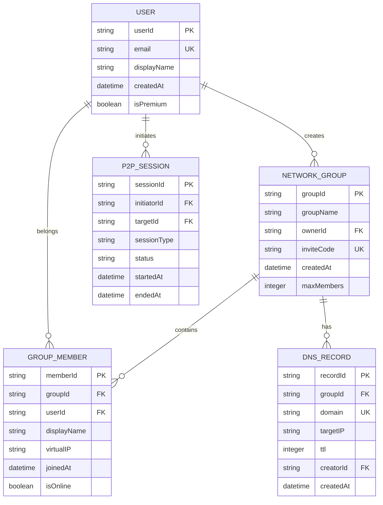
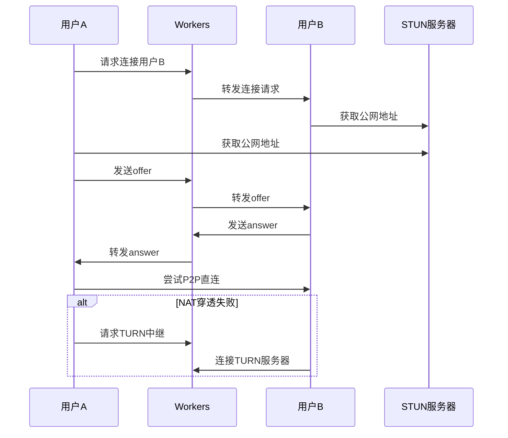
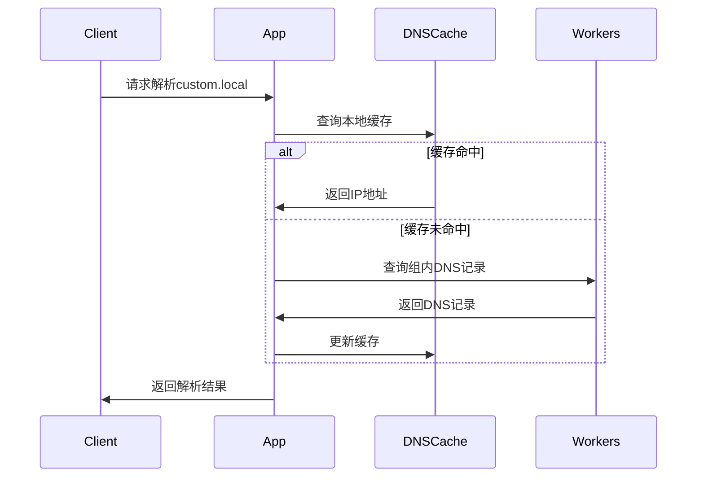

## 1. 架构设计



## 2. 技术栈描述

**核心组网模块**:

* **运行时**: Rust + Tokio (高性能异步网络)

* **P2P通信**: WebRTC + QUIC + NAT穿透

* **DNS拦截**: 本地DNS代理 + 自定义解析器

* **配置存储**: SQLite (本地加密存储)

**上层功能模块**:

* **远程控制**: Rust + 屏幕捕获编码 + 输入同步

* **屏幕投射**: Rust + H.264/H.265编码 + RTP传输

**轻量级服务**:

* **信令服务器**: Cloudflare Workers (仅协调连接)

* **中继服务器**: TURN服务器 (fallback模式)

* **初始化工具**: cargo (Rust包管理)

## 3. 模块接口定义

### 3.1 核心组网模块接口

| 接口                    | 用途      | 参数             |
| --------------------- | ------- | -------------- |
| create\_group()       | 创建网络组   | 组名, 最大成员数      |
| join\_group()         | 加入网络组   | 邀请码, 本地配置      |
| establish\_p2p()      | 建立P2P连接 | 目标设备ID, 连接模式   |
| add\_custom\_domain() | 添加本地域名  | 域名, 虚拟IP, 访问规则 |
| resolve\_domain()     | 本地域名解析  | 域名, 客户端IP      |

### 3.2 上层功能模块接口

| 接口                       | 用途     | 依赖        |
| ------------------------ | ------ | --------- |
| start\_remote\_control() | 启动远程桌面 | 已建立的P2P连接 |
| start\_screen\_cast()    | 启动屏幕共享 | 已建立的P2P连接 |
| configure\_access()      | 配置访问权限 | 本地安全策略    |

### 3.3 本地配置文件结构

```json
{
  "local_config": {
    "device_id": "unique_device_id",
    "private_key": "encrypted_private_key",
    "custom_domains": {
      "git-server.local": {
        "virtual_ip": "10.0.0.100",
        "access_rules": ["allow 10.0.0.0/8"],
        "ports": [22, 80, 443]
      }
    },
    "security_policy": {
      "encryption_level": "end-to-end",
      "allowed_ips": [],
      "blocked_ips": []
    }
  }
}
```

## 4. API定义

### 4.1 最小化信令API (Cloudflare Workers)

**创建网络组（仅存储关系）**

```
POST /api/group/create
```

请求:
\| 参数名 | 参数类型 | 是否必需 | 描述 |
\|-----------|-------------|-------------|
\| deviceId | string | 是 | 设备ID（哈希处理） |
\| groupName | string | 是 | 网络组名称 |

响应:

| 参数名          | 参数类型   | 描述      |
| ------------ | ------ | ------- |
| groupId      | string | 网络组唯一标识 |
| inviteCode   | string | 一次性邀请码  |
| relayServers | array  | 中继服务器列表 |

**加入网络组（仅验证关系）**

```
POST /api/group/join
```

请求:
\| 参数名 | 参数类型 | 是否必需 | 描述 |
\|-----------|-------------|-------------|
\| deviceId | string | 是 | 设备ID（哈希处理） |
\| inviteCode | string | 是 | 邀请码 |

响应:

| 参数名          | 参数类型   | 描述              |
| ------------ | ------ | --------------- |
| groupId      | string | 网络组ID           |
| memberList   | array  | 组成员ID列表（不含敏感信息） |
| relayServers | array  | 中继服务器列表         |

**P2P协调（无数据存储）**

```
POST /api/p2p/coordinate
```

请求:
\| 参数名 | 参数类型 | 是否必需 | 描述 |
\|-----------|-------------|-------------|
\| fromDevice | string | 是 | 发起设备ID |
\| toDevice | string | 是 | 目标设备ID |
\| connectionType | string | 是 | 连接类型(p2p/relay) |

### 4.2 本地DNS解析API（本地调用，无网络请求）

**添加本地域名记录**

```
LOCAL addCustomDomain(domain, virtualIP, rules)
```

**本地域名查询**

```
LOCAL resolveDomain(domain, clientIP)
```

**删除域名记录**

```
LOCAL removeDomain(domain)
```

## 5. 模块化架构图



### 5.1 本地架构详细设计



## 6. 数据模型

### 6.1 数据模型定义



### 6.2 数据定义语言

**用户表 (users)**

```sql
-- 创建表
CREATE TABLE users (
    user_id UUID PRIMARY KEY DEFAULT gen_random_uuid(),
    email VARCHAR(255) UNIQUE NOT NULL,
    password_hash VARCHAR(255) NOT NULL,
    display_name VARCHAR(100) NOT NULL,
    is_premium BOOLEAN DEFAULT FALSE,
    created_at TIMESTAMP WITH TIME ZONE DEFAULT NOW()
);

-- 创建索引
CREATE INDEX idx_users_email ON users(email);
```

**网络组表 (network\_groups)**

```sql
-- 创建表
CREATE TABLE network_groups (
    group_id UUID PRIMARY KEY DEFAULT gen_random_uuid(),
    group_name VARCHAR(100) NOT NULL,
    owner_id UUID REFERENCES users(user_id),
    invite_code VARCHAR(20) UNIQUE NOT NULL,
    max_members INTEGER DEFAULT 10,
    created_at TIMESTAMP WITH TIME ZONE DEFAULT NOW()
);

-- 创建索引
CREATE INDEX idx_groups_invite_code ON network_groups(invite_code);
```

**DNS记录表 (dns\_records)**

```sql
-- 创建表
CREATE TABLE dns_records (
    record_id UUID PRIMARY KEY DEFAULT gen_random_uuid(),
    group_id UUID REFERENCES network_groups(group_id),
    domain VARCHAR(255) NOT NULL,
    target_ip INET NOT NULL,
    ttl INTEGER DEFAULT 300,
    creator_id UUID REFERENCES users(user_id),
    created_at TIMESTAMP WITH TIME ZONE DEFAULT NOW(),
    UNIQUE(group_id, domain)
);

-- 创建索引
CREATE INDEX idx_dns_group_domain ON dns_records(group_id, domain);
CREATE INDEX idx_dns_created_at ON dns_records(created_at DESC);
```

## 7. P2P连接流程

### 7.1 NAT穿透流程



### 7.2 自定义DNS解析流程



## 8. 安全设计

### 8.1 连接安全

* WebRTC强制使用DTLS加密

* 信令服务器使用HTTPS

* 支持端到端加密选项

### 8.2 访问控制

* 网络组访问需要邀请码

* 支持IP白名单

* 连接日志记录

### 8.3 数据保护

* 用户密码bcrypt加密存储

* DNS记录组内隔离

* 定期清理过期记录

